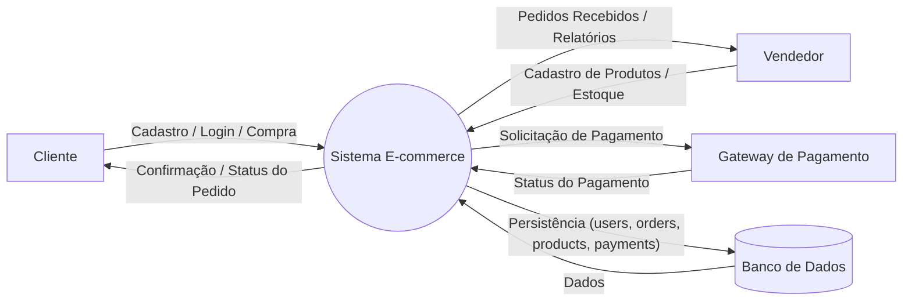
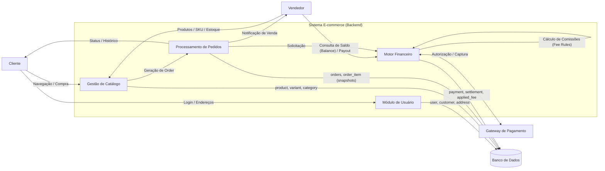

## Diagramas de Fluxo de Dados

### Nível 0

### Nível 1

### Diagrama Conceitual - dbdiagram.io

Documentação adicional com informações das tabelas disponível em:
[Documentação do diagrama conceitual](https://dbdocs.io/luis.coelho.761/ecommerce-conceitual)

## Modelo Entidade-Relacionamento

Documentação em HTML com informações do MER, comentários das tabelas e suas respectivas colunas
[Documentação do diagrama](https://dbdocs.io/luis.coelho.761/ecommerce)