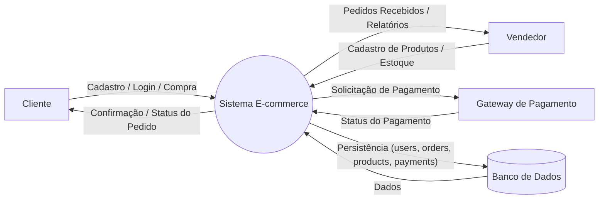
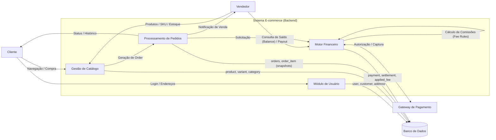

# Autores

- Luís Augusto Coelho de Souza - RA00331675
- Guilherme Schnekenberg Teixeira - RA00336189

# Descrição 

Este projeto consiste em uma infraestrutura de banco de dados robusta para um ecossistema de Marketplace Multi-vendor. O sistema foi desenhado para suportar múltiplos vendedores (Sellers) e compradores (Customers), gerenciando desde o catálogo de produtos e controle de estoque até o fluxo financeiro complexo de liquidação de pagamentos e taxas de intermediação.

### Arquitetura do Sistema
O projeto é dividido em quatro sub-domínios principais, garantindo a separação de responsabilidades e facilitando a escalabilidade:

1. User
Gestão de Identidade: Sistema de usuários unificado com especializações para Clientes (Pessoa Física/CPF) e Vendedores (Pessoa Jurídica/CNPJ).

Address Management: Suporte a múltiplos endereços por usuário, distinguindo entre endereços de entrega, cobrança, lojas físicas e centros de distribuição (warehouses).

2. Catalog & Inventory
Variantes de Produto (SKU): Gerenciamento de estoque em nível de variante, permitindo que um mesmo produto tenha diferentes cores, tamanhos ou especificações com preços e estoques distintos.

Hierarquia de Categorias: Organização de catálogo através de uma estrutura de categorias autorreferenciável (N-níveis).

3. Order Management
Snapshots de Compra: O sistema preserva a integridade histórica salvando o nome do produto, SKU e preço unitário no momento exato da venda, evitando que alterações futuras no catálogo corrompam dados de pedidos antigos.

Rastreabilidade: Histórico completo de status do pedido (Created, Paid, Shipped, Delivered, etc.).

4. Finance & Marketplace Intelligence
Fluxo de Pagamento: Gestão de tentativas de cobrança (Charges), suporte a múltiplos métodos de pagamento (PIX, Boleto, Cartão) e liquidação de parcelas (Settlements).

Motor de Taxas (Fee Engine): Sistema flexível de regras de comissionamento do marketplace, permitindo taxas fixas ou percentuais com limites mínimos e máximos.

Seller Balance: Controle de saldo e fluxo de repasse (Payout) para os vendedores parceiros.

## Diagramas de Fluxo de Dados

### Nível 0

### Nível 1

### Diagrama Conceitual - dbdiagram.io

Documentação adicional com informações das tabelas disponível em:
[Documentação do diagrama conceitual](https://dbdocs.io/luis.coelho.761/ecommerce-conceitual)

## Modelo Entidade-Relacionamento

Documentação em HTML com informações do MER, comentários das tabelas e suas respectivas colunas
[Documentação do diagrama](https://dbdocs.io/luis.coelho.761/ecommerce)

# Entregáveis

Os entregáveis do exercício pedido estão em:

1) Sumário executivo do projeto e DFD (Diagrama de Fluxo de Dados – Nível 0): 
PDF título, equipe, gráfico DFD e texto (descrição do projeto e do DFD)  
A equipe decidiu manter a descrição do projeto e o DFD como o README deste repositório.

2) Modelo de Dados Conceitual – Nome das tabelas, relacionamentos e descrição de cada tabela: PDF, diagrama e texto  
[Modelo de Dados Conceitual](https://dbdocs.io/luis.coelho.761/ecommerce-conceitual)  

3) Modelo de Dados Físico – Diagrama MER – MySQL Workbench: PDF, .html e .mwb  
[Modelo de Dados Físico MWB](https://github.com/Luis-coelho30/ecommerce-data-modeling/blob/main/docs/mer/ecommerce_marketplace_mer.mwb)  
[Modelo de Dados Físico PDF](https://github.com/Luis-coelho30/ecommerce-data-modeling/blob/main/docs/mer/entity-relation-diagram.pdf)  
[Modelo de Dados Físico HTML](https://dbdocs.io/luis.coelho.761/ecommerce)

4) Dicionário de dados, detalhes de cada tabela e campos, PK, FK, etc…: PDF  
[Dicionário de dados](https://github.com/Luis-coelho30/ecommerce-data-modeling/blob/main/docs/data_dictionary.pdf)  

5) Código com script para criação do banco de dados e carga de dados de teste (MySQL): .sql (bem comentado)  
[Criação do banco de dados](https://github.com/Luis-coelho30/ecommerce-data-modeling/blob/main/ecommerce_marketplace_schema.sql)  
[Carga de dados de teste](https://github.com/Luis-coelho30/ecommerce-data-modeling/blob/main/data/data_dump.sql)

6) QA: Questões de negócios e QUERY (SQL) com respostas/resultados: PDF
[Questões de negócios](https://github.com/Luis-coelho30/ecommerce-data-modeling/blob/main/docs/quality_assurance.pdf)